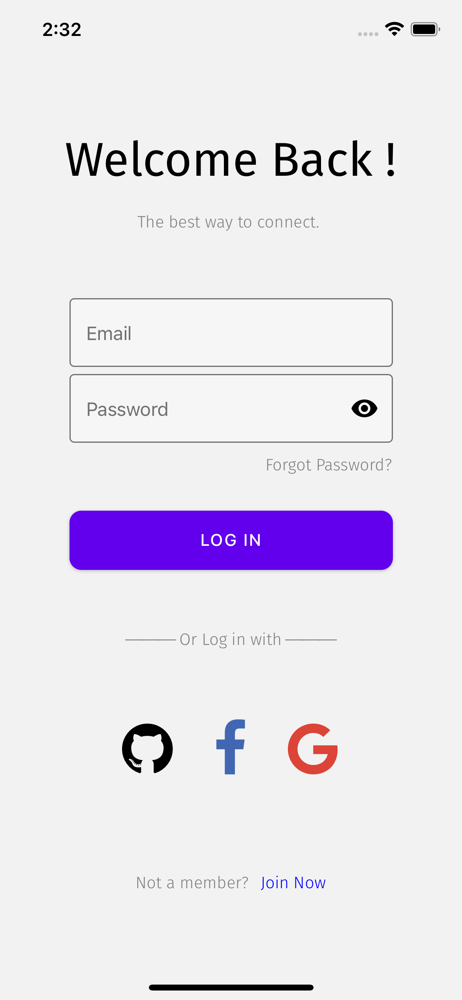
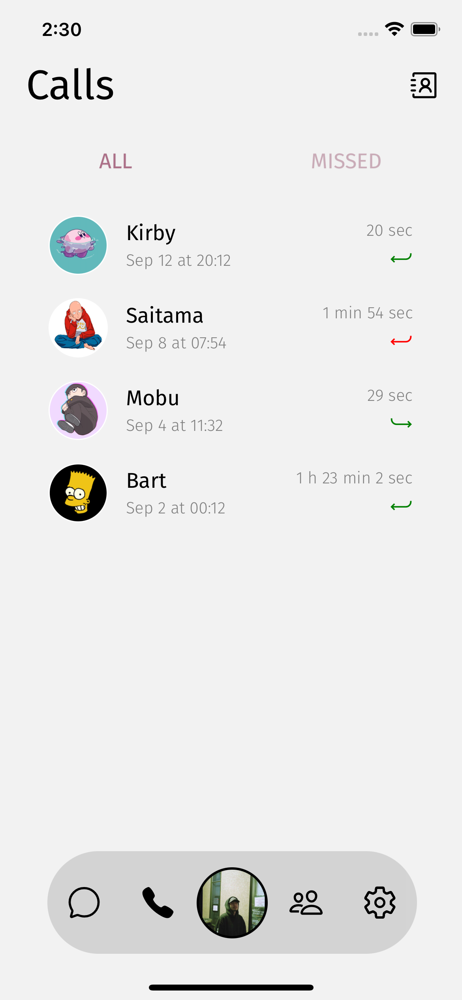

# One Chat

A cross platform social chatting app built with react native expo. 

 
 
 

 

 
 
 

## Getting Started

These instructions will give you a copy of the project up and running on
your local machine for development and testing purposes. See deployment
for notes on deploying the project on a live system.

### Prerequisites

Requirements for the software and other tools to build, test and push 
- [React native](https://www.example.com)
- [Expo](https://www.example.com)

### Installing

A step by step series of examples that tell you how to get a development
environment running

Install all dependences

    npm install
    

## Running the app

    npm start or expo start 

## Built With

  - [React Native](https://reactnative.dev/) - Framwork
  - [Expo](https://docs.expo.dev/) - Framwork
  - [Firebase](https://firebase.google.com/) - Used for authantication and database
  - [React Navigation](https://reactnavigation.org/) - Used for stacks navigation
  - [React Native Gifted Chat](https://github.com/FaridSafi/react-native-gifted-chat) - Used for chat screen UI 
  - [React Native Vector Icons](https://github.com/oblador/react-native-vector-icons) - Used for icons

 
## Authors

  - **Thomas Lin**  (https://github.com/thomas4246) - *Developer* -

## License

This project is licensed under the [CC0 1.0 Universal](LICENSE.md)
Creative Commons License - see the [LICENSE.md](LICENSE.md) file for
details

